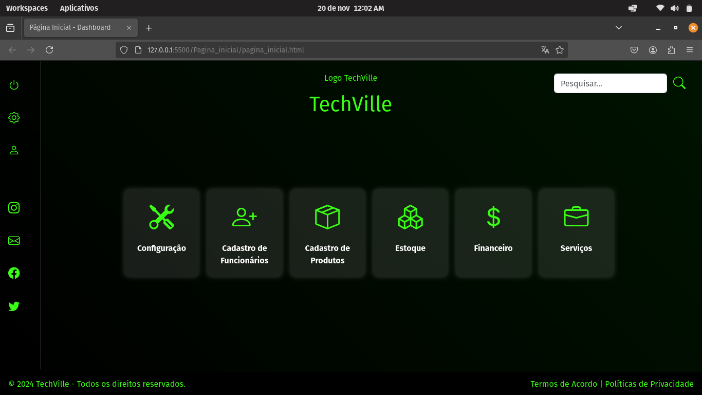
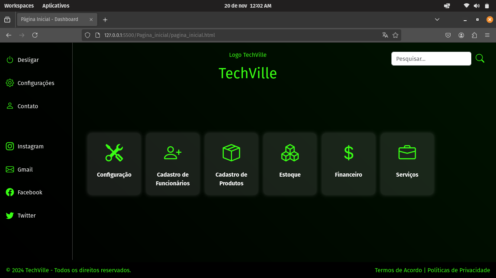
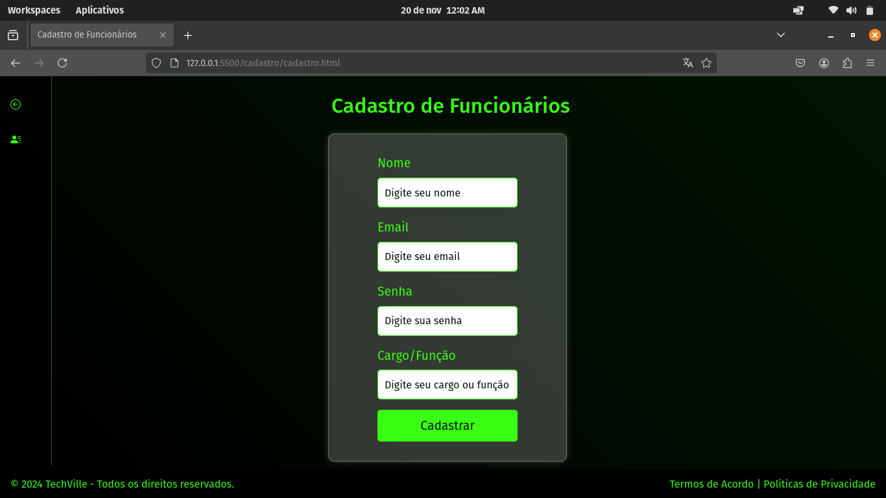
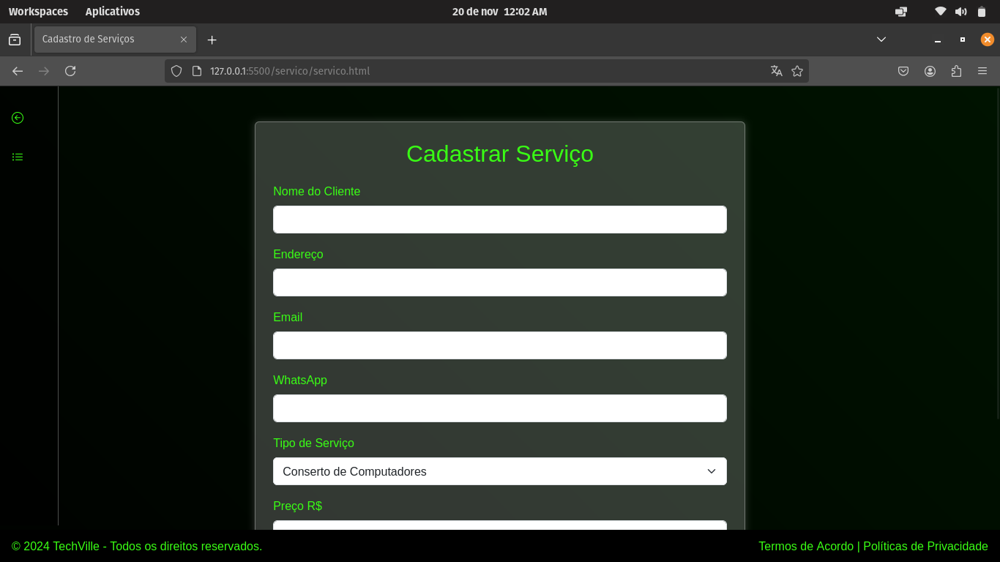
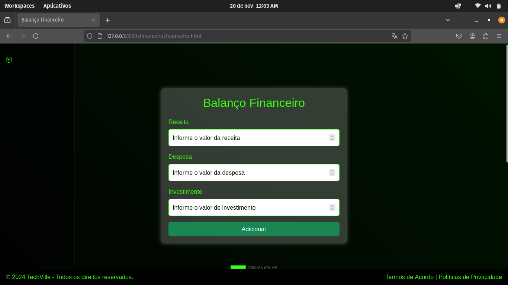
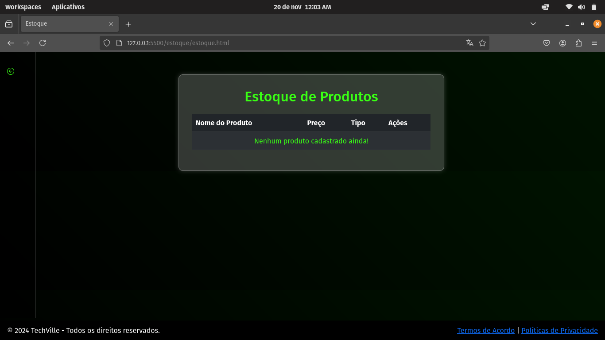
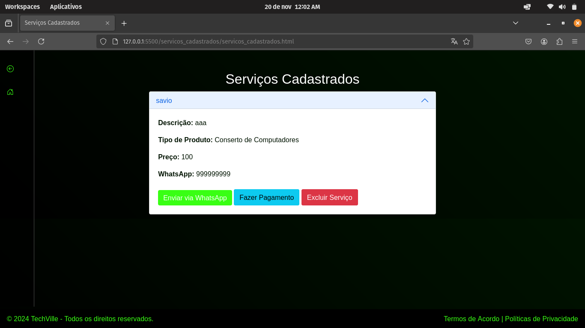

# Projeto-Web - Sistema de Loja de Informática
Um sistema ainda em desenvolvimento, com a ideia de ser um sistema mais avançado em loja.

### Como usar? 
Baixe o repositório e inicie o index.html. Note que terá usuário e senha 

### Login ###
Usuário: admin
Senha: 1234

### Armazenamento ###
Banco de dados é usado em LocalStorage, caso venha a apagar seu cache e cookies do navagador, os dados salvos serão perdidos. 

### Avisos ###
O sistema ainda está em desenvolvimento, por isso alguns bugs serão encontrados

# Imagens do projeto:

# 

# 

# 

# 

# 

# 
